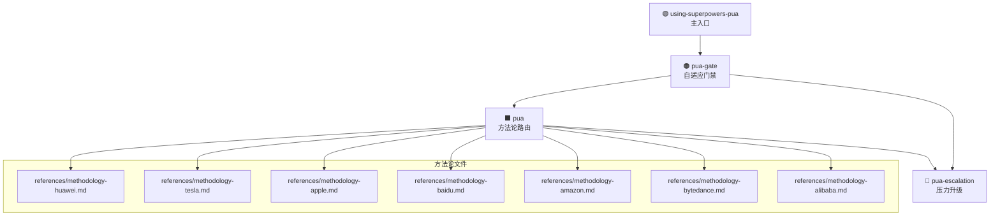

# PUA 流程与技能协作指南

## 概述

本文档详细说明 PUA-Driven Spec Engineering 的完整流程和技能协作逻辑，帮助开发者理解项目结构、使用方法和注意事项。

## 核心灵魂：味道判定协议与方法论

[CRITICAL] 味道判定协议和方法论是整个 PUA 流程的灵魂，驱动所有技能执行。

**核心机制**：
- **味道判定协议**：根据任务类型自动选择文化味道（阿里味、华为味、Musk味等），决定沟通风格和执行策略
- **方法论路由**：根据任务类型选择最优方法论文件，真实引导 LLM 读取并执行
- **灵魂定调**：每次对话开始时，通过 `using-superpowers-pua` 加载味道和方法论，为整个执行过程定调
- **执行驱动**：所有技能 SOP 流程都围绕味道和方法论展开，确保执行的一致性和有效性

**⚠️ 味道方法论必须声明**：在执行任何任务前，必须先声明当前使用的味道和方法论。这是执行下一步的前提条件。详见 `pua` 技能的「味道判定协议」和「方法论智能路由」章节。

**执行流程**：
1. **入口加载**：通过 `using-superpowers-pua` 加载味道和方法论
2. **味道方法论声明**：必须先声明当前使用的味道和方法论
3. **门禁判断**：通过 `pua-gate` 进行门禁判断，确定任务档位
4. **方法论选择**：根据任务类型选择最优方法论文件
5. **技能执行**：所有技能执行都围绕味道和方法论展开
6. **压力升级**：失败时通过 `pua-escalation` 切换方法论

## 核心技能职责划分

### 1. `pua` - 方法论智能路由引擎

**职责**：
- 方法论智能路由：按任务类型选择最优方法论
- 味道文化：提供 13 种大厂味道的文化基因
- 通用方法论：卡壳时的强制执行方法

**核心功能**：
- 接到任务后，分析任务类型，引导 LLM 读取对应方法论文件
- 在开发过程中，按照方法论文件的指导执行
- 失败时，引导 LLM 读取其他方法论文件

**方法论文件路由**：
| 任务类型 | 推荐味道 | 方法论文件 | 核心方法 |
|---------|---------|-----------|---------|
| Debug/修 Bug | 🔴 华为 | `references/methodology-huawei.md` | RCA 根因分析 + 蓝军自攻击 |
| 构建新功能 | ⬛ Musk | `references/methodology-tesla.md` | The Algorithm: 质疑→删除→简化→加速→自动化 |
| 代码审查 | ⬜ Jobs | `references/methodology-apple.md` | 减法优先 + 像素级完美 + DRI |
| 调研/搜索 | ⚫ 百度 | `references/methodology-baidu.md` | 搜索是第一生产力 |
| 架构决策 | 🔶 Amazon | `references/methodology-amazon.md` | Working Backwards + 6-Pager |
| 性能优化 | 🟡 字节 | `references/methodology-bytedance.md` | A/B Test + 数据驱动 |
| 部署/运维 | 🟠 阿里 | `references/methodology-alibaba.md` | 定目标→追过程→拿结果闭环 |
| 任务模糊 | 🟠 阿里 | `references/methodology-alibaba.md` | 通用闭环（默认） |

### 2. `pua-gate` - 自适应门禁

**职责**：
- 门禁判断：判断任务档位（G0-G4）
- 需求成熟度评估：评估需求的清晰度
- 风险评估：评估变更风险等级（R0-R4）

**核心功能**：
- 每个 skill 的第 0 步都必须经过门禁
- 根据成熟度、风险、影响面定档
- 决定轻量快放、澄清、设计、升级或阻塞

**门禁档位**：
- **G0**：一句话回答，无风险
- **G1**：轻量快放，低风险
- **G2**：多步骤或跨文件任务
- **G3**：高风险变更，需设计
- **G4**：关键风险，BLOCKED

### 3. `pua-escalation` - 压力升级引擎

**职责**：
- 压力升级：统一处理所有压力升级
- 失控处理：处理各类失控场景
- 失败模式切换：失败时切换方法论

**核心功能**：
- 检测失败信号：连续失败、用户不满、事实错误等
- 执行压力升级：E1-E4 压力等级
- 切换方法论：失败时切换到更合适的方法论
- 抗合理化：识别并反击各种借口

**压力等级**：
- **E1**：用户催压 / 第 1 次明显漂移
- **E2**：第 2 次失败 / 事实错误 / 开始跳步骤
- **E3**：第 3-4 次失败 / 乱补丁 / review 处理失真
- **E4**：准备假完成 / 想甩锅 / 流程明显失控

### 4. `code-quality-check-pua` - 代码质量检查

**职责**：
- 代码质量检查：集成代码审查、代码简化、代码分析和功能验证
- 质量把关：确保代码质量符合标准

**核心功能**：
- 代码审查：检查代码质量、发现潜在问题、优化代码性能、检查安全漏洞
- 代码简化：简化和优化代码
- 代码分析：分析代码质量，找出潜在问题和改进建议
- 功能验证：验证代码功能是否正确实现

### 5. `llm-degradation-detector` - LLM 推理能力诊断

**职责**：
- 推理能力诊断：检测 AI 质量下降
- 质量监控：监控 AI 回答质量

**核心功能**：
- 九维自评：评估 AI 的推理能力
- 推理等级报告：输出推理等级报告
- 质量下降检测：检测 AI 是否在降智、敷衍或绕圈

### 6. `pua-learning-loop` - 学习循环

**职责**：
- 学习循环：记录踩坑经验
- 知识沉淀：防止重复踩坑

**核心功能**：
- 记录用户纠正：记录用户纠正的经验
- 记录重复失败：记录重复失败的经验
- 记录可复用坑点：记录可复用坑点的经验

## 流程协作

### 1. 任务开始

```
用户输入 → using-superpowers-pua（入口）
         → pua-gate（门禁判断）
         → pua（方法论路由）
         → 读取对应方法论文件
```

### 2. 设计阶段

```
brainstorming-pua（设计）
  ↓
pua-gate（门禁）
  ↓
OpenSpec 文档生成
  ↓
用户确认
```

### 3. 计划阶段

```
writing-plans-pua（计划）
  ↓
pua-gate（门禁）
  ↓
任务拆解
  ↓
用户确认
```

### 4. 执行阶段

```
executing-plans-pua（执行）
  ↓
pua-gate（门禁）
  ↓
代码实现
  ↓
code-quality-check-pua（代码质量检查）
  ↓
验证
```

### 5. 代码质量检查

```
code-quality-check-pua（代码质量检查）
  ↓
code-review（代码审查）
  ↓
cs-doc（注释检查）
  ↓
cs-simplify（代码简化）
  ↓
cs-analyze（代码分析）
  ↓
function-validation（功能验证）
```

### 6. 学习点记录

```
pua-learning-loop（学习循环）
  ↓
检测学习信号
  ↓
读取 LEARNING_INDEX.md
  ↓
匹配学习卡片
  ↓
执行学习动作
  ↓
更新学习卡片
```

### 7. 失败处理

```
失败信号检测
  ↓
pua-escalation（压力升级）
  ↓
失败模式分析
  ↓
方法论切换（调用 pua）
  ↓
回到原 skill 继续执行
```

### 8. LLM 推理能力诊断

```
AI 回答质量可疑 / 连续失败 2+ 次 / 输出疑似幻觉
  ↓
llm-degradation-detector（推理能力诊断）
  ↓
九维自评
  ↓
推理等级报告
  ↓
质量下降检测
```

## 使用方法

### 1. 首次使用

1. 安装 PUA 技能套件
2. 阅读本文档了解流程
3. 阅读 `skills/pua/SKILL.md` 了解方法论路由

### 2. 日常使用

1. 每次对话开始时，自动加载 `using-superpowers-pua`
2. 根据任务类型，自动选择方法论
3. 按照方法论文件的指导执行
4. 代码实现完成后，执行 `code-quality-check-pua` 进行代码质量检查
5. 失败时，按照压力升级流程处理
6. 用户纠正或重复失败时，执行 `pua-learning-loop` 记录学习点

### 3. 自定义配置

1. 在 `~/.pua/config.json` 中设置默认味道
2. 使用 `/pua flavor` 命令切换味道
3. 在 `~/.pua/builder-journal.md` 中查看失败记录

## 注意事项

### 1. 必须遵守的规则

- **先技能后行动**：每次对话开始时，第一个动作必须是读取 `skills/using-superpowers-pua/SKILL.md`
- **先查后问**：涉及代码变更时，必须先搜索/读取文件，再开口
- **先证据后结论**：声称"完成/修复/通过"前，必须贴出验证命令和真实输出

### 2. 禁止的行为

- **禁止没查事实就说"我理解了"**
- **禁止没读项目说明和代码规范就直接改文件**
- **禁止未确认 OpenSpec 前一层就生成后一层**
- **禁止 R2+ 变更没有文档就开写**

### 3. 常见问题

**Q: 方法论路由不生效怎么办？**
A: 检查是否正确加载了 `pua` skill，并确保 `references/` 目录下的方法论文件存在。

**Q: 压力升级过于频繁怎么办？**
A: 检查是否真正理解了需求，是否按照方法论文件的指导执行。

**Q: 如何切换味道？**
A: 使用 `/pua flavor` 命令，或在 `~/.pua/config.json` 中设置 `"flavor"` 字段。

## 技能调用关系图



## 相关文档

- [Skill 调用关系可视化](skill-call-diagram.md)
- [快速开始指南](../docs/QUICKSTART.md)
- [场景示例](../docs/SCENARIOS.md)
- [决策树](../docs/DECISION-TREE.md)

## 更新日志

### 2026-05-16
- 初始版本
- 明确了三个核心 skill 的职责划分
- 添加了流程协作说明
- 添加了使用方法和注意事项