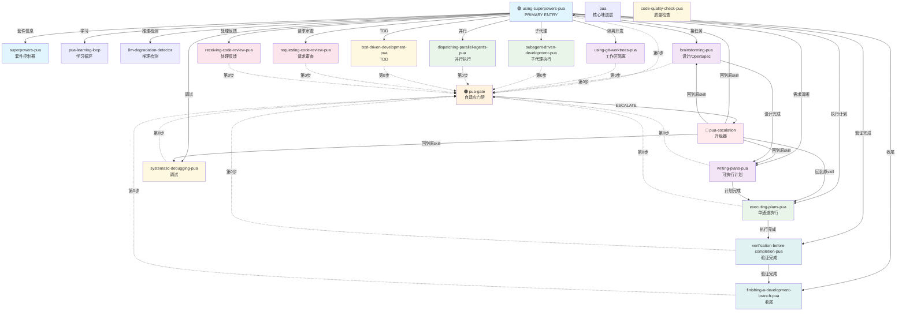

# Skill 调用关系可视化

## 概述
本文档提供了 PUA-Driven Spec Engineering 技能套件的调用关系可视化图表，帮助理解技能之间的调用逻辑和依赖关系。

## 核心灵魂：味道判定协议与方法论

[CRITICAL] 味道判定协议和方法论是整个 PUA 流程的灵魂，驱动所有技能执行。

**核心机制**：
- **味道判定协议**：根据任务类型自动选择文化味道（阿里味、华为味、Musk味等），决定沟通风格和执行策略
- **方法论路由**：根据任务类型选择最优方法论文件，真实引导 LLM 读取并执行
- **灵魂定调**：每次对话开始时，通过 `using-superpowers-pua` 加载味道和方法论，为整个执行过程定调
- **执行驱动**：所有技能 SOP 流程都围绕味道和方法论展开，确保执行的一致性和有效性

**⚠️ 味道方法论必须声明**：在执行任何任务前，必须先声明当前使用的味道和方法论。这是执行下一步的前提条件。详见 `pua` 技能的「味道判定协议」和「方法论智能路由」章节。

**在调用关系中的体现**：
- **入口**：`using-superpowers-pua` 加载味道和方法论
- **味道方法论声明**：必须先声明当前使用的味道和方法论
- **门禁**：`pua-gate` 根据味道和方法论进行门禁判断
- **执行**：所有技能执行都围绕味道和方法论展开
- **升级**：`pua-escalation` 在失败时切换方法论

## 核心调用流程图



## 调用关系说明

### 入口层
- **using-superpowers-pua**：主入口，负责任务路由
- **superpowers-pua**：套件控制器，声明所有组件

### 核心机制层
- **pua-gate**：自适应门禁，专注于门禁判断、需求成熟度评估和风险评估
- **pua-escalation**：压力升级引擎，专注于压力升级、失控处理和失败模式切换
- **pua**：方法论智能路由引擎，专注于方法论路由、味道文化和通用方法论
- **pua-learning-loop**：学习循环，记录踩坑经验
- **llm-degradation-detector**：推理检测，诊断AI质量

### 设计/计划层
- **brainstorming-pua**：设计/OpenSpec，需求澄清与设计
- **writing-plans-pua**：可执行计划，把设计转化为任务
- **using-git-worktrees-pua**：工作区隔离，隔离开发分支

### 执行层
- **executing-plans-pua**：单通道执行，按计划顺序执行
- **subagent-driven-development-pua**：子代理执行，分工执行
- **dispatching-parallel-agents-pua**：并行执行，多任务并行

### 质量层
- **test-driven-development-pua**：TDD，测试驱动开发
- **systematic-debugging-pua**：调试，系统化调试
- **code-quality-check-pua**：代码质量检查，集成代码审查、代码简化、代码分析和功能验证

### 诊断层
- **llm-degradation-detector**：LLM 推理能力诊断，检测 AI 质量下降

### 审查层
- **requesting-code-review-pua**：请求审查，发起code review
- **receiving-code-review-pua**：处理反馈，处理review反馈

### 验证/收尾层
- **verification-before-completion-pua**：验证完成，完成前验证
- **finishing-a-development-branch-pua**：收尾，明确收尾

## 调用规则

### 必须遵守的调用规则
1. **入口规则**：每次对话开始时，第一个动作必须是 `use_skill("using-superpowers-pua")`
2. **门禁规则**：门禁评估前必须先完成理解动作
3. **升级规则**：门禁结果为 `ESCALATE` 时，必须调用 `pua-escalation`
4. **返回规则**：调用 `pua-escalation` 后，必须回到原 skill 继续执行

### 调用条件
- **G0/G1**：普通问题轻量快放，输出一行微标
- **G2**：多步骤或跨文件任务输出简版门禁
- **ESCALATE**：立即调用 `pua-escalation`，再回到本 skill
- **BLOCKED**：补齐输入或证据，不得继续

## 依赖关系

### 强依赖
- 所有skill都依赖 `pua-gate`（门禁）
- 所有skill都可能依赖 `pua-escalation`（升级）
- 执行层依赖设计层（设计完成才能执行）
- 质量检查依赖执行层（执行完成才能检查）
- 验证层依赖质量层（质量检查完成才能验证）

### 弱依赖
- 学习循环（可选）
- 推理检测（可选）
- 工作区隔离（可选）

## 使用场景

### 新功能开发
```
using-superpowers-pua → brainstorming-pua → writing-plans-pua → executing-plans-pua → code-quality-check-pua → verification-before-completion-pua → pua-learning-loop
```

### Bug修复
```
using-superpowers-pua → systematic-debugging-pua → executing-plans-pua → code-quality-check-pua → verification-before-completion-pua → pua-learning-loop
```

### 代码审查
```
using-superpowers-pua → requesting-code-review-pua → receiving-code-review-pua → code-quality-check-pua → verification-before-completion-pua → pua-learning-loop
```

### 质量检查
```
using-superpowers-pua → code-quality-check-pua → verification-before-completion-pua → pua-learning-loop
```

## 可视化工具

### Mermaid
本文档使用Mermaid语法，可以在支持Mermaid的Markdown编辑器中渲染。

### PlantUML
也可以使用PlantUML创建类似的图表，格式略有不同。

### 其他工具
- Graphviz
- Draw.io
- Lucidchart

## 维护

### 更新图表
当添加新skill或修改调用关系时，需要更新本文档。

### 验证准确性
定期验证图表与实际调用关系的一致性。

### 收集反馈
收集用户反馈，改进图表的可读性和准确性。